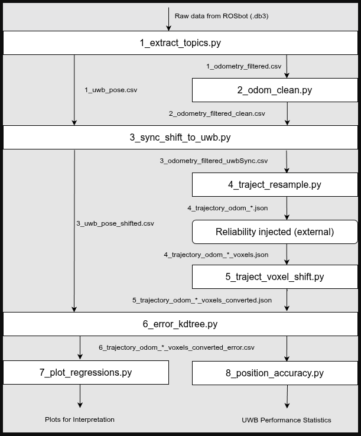

# UWB Localization Analysis Pipeline

This pipeline processes odometry and UWB positioning data recorded during robot experiments, and calculates 2D positioning error using wheel odometry as ground truth. The error is compared against a simulation-derived reliability index based on PDOP anchor geometry scoring and ray-casting line-of-sight visibility. The pipeline outputs intermediate files at each stage, regression plots with R² scores across three curve-fitting models, and a text report containing standard positioning accuracy metrics.

---

## Pipeline Diagram

<p align="center">
  
</p>

---

## How to Run

### Prerequisites

**Python packages** (install via pip):
```bash
pip install pandas numpy matplotlib scipy scikit-learn pyyaml
```

**ROS 2** (required for Stage 1 only):
- ROS 2 Humble or later with `rosbag2`, `rclpy`, and `rosidl_runtime_py`
- Stages 2–8 run without ROS 2

**External dependency:**
- OSM3DM simulation program — required between Stages 4 and 5 to inject voxel reliability scores into the trajectory JSON files. Stages 5–8 cannot proceed without this step.

### Input Data

- One `.db3` ROS 2 bag file placed in the same directory as `1_extract_all_topics.py`
- Voxel-annotated JSON files from OSM3DM (produced between Stages 4 and 5)

### Execution Order

```
1_extract_all_topics.py
2_odom_removeZeros.py
3_sync_and_shift_all_to_uwb.py
4_trajectory_all.py --profile [high|low]
→ Run OSM3DM color intensity injection on output JSON files
5_voxel_hits_batch_converter.py
6_kdtree.py
7d_plot_regressions.py      (and/or 7a, 7b, 7c)
8_compute_position_accuracy_batch.py
```

---

## Output Files

| Stage | File(s) | Contents |
|-------|---------|----------|
| 1 | `1_odometry_filtered.csv`, `1_uwb_pose.csv` | Timestamped position and orientation extracted from ROS 2 bag |
| 2 | `2_odometry_filtered_clean.csv` | Odometry data with all-zero rows removed |
| 3 | `3_odometry_filtered_uwbSync.csv`, `3_uwb_pose_shifted.csv` | Timestamp-synchronised odometry and origin-shifted UWB data |
| 4 | `4_trajectory_odom_[profile]_*.json` | Resampled trajectory at 0.1m, 0.2m, 0.5m, 1.0m intervals |
| 5 | `5_trajectory_odom_*_converted.json` | Axis-remapped and origin-shifted voxel trajectory data |
| 6 | `6_trajectory_odom_*_error.csv` | Per-point 2D positioning error with matched voxel reliability scores |
| 7 | `7d_plot_regressions.png` | Regression plots with R² scores |
| 8 | `8_*_stat.txt` | Positioning accuracy metrics: RMSE, DRMS, CEP50, R95 and others |
